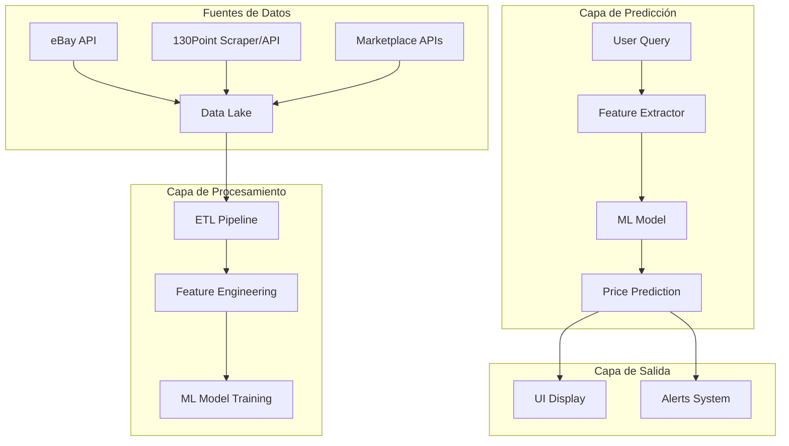
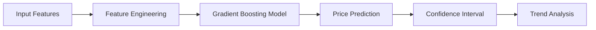

# Plan de Integración: 130Point + Sistema de Predicción ML

## Objetivo

Integrar datos históricos de precios de tarjetas deportivas y crear un sistema de predicción de precios usando Machine Learning.

## Arquitectura General



## Fase 1: Investigación y Scraper de 130Point

### 1.1 Investigación de 130Point

- **URL principal**: <https://www.130point.com/>
- **Contenido**: Precios de ventas de tarjetas graded por PSA, BGS, SGC
- **Estructura típica**: Buscar por jugador, año, marca, número de tarjeta

### 1.2 Crear Herramienta de Scraping/API

```python
# src/tools/one_thirty_point_tool.py

from typing import List, Optional
from pydantic import BaseModel
from datetime import datetime

class OneThirtyPointSale(BaseModel):
    """Representación de una venta en 130Point"""
    card_id: str
    player_name: str
    year: int
    brand: str
    card_number: str
    grade: str  # PSA 10, BGS 9.5, etc.
    sale_price: float
    sale_date: datetime
    sale_url: str
    auction_type: str  # auction, buy_it_now, etc.

class OneThirtyPointTool:
    """Herramienta para obtener datos de 130Point"""

    async def search_sales(
        self,
        player_name: str,
        year: Optional[int] = None,
        brand: Optional[str] = None,
        min_grade: Optional[str] = None,
        max_results: int = 50
    ) -> List[OneThirtyPointSale]:
        """Busca ventas históricas de una tarjeta"""
        pass

    async def get_price_history(
        self,
        card_id: str,
        days_back: int = 365
    ) -> List[PricePoint]:
        """Obtiene historial de precios para una tarjeta específica"""
        pass
```

### 1.3 Patrón de Scraper

```python
# src/utils/scraping_utils.py

import httpx
from bs4 import BeautifulSoup
from src.utils.exceptions import ScrapingError

class OneThirtyPointScraper:
    """Scraper para 130Point"""

    BASE_URL = "https://www.130point.com"

    async def search_cards(self, query: str) -> dict:
        """
        Busca cartas en 130Point
        URL típica: https://www.130point.com/players/{player}/sales/
        """
        async with httpx.AsyncClient(timeout=30.0) as client:
            response = await client.get(
                f"{self.BASE_URL}/search",
                params={"q": query}
            )
            response.raise_for_status()
            return self._parse_results(response.text)

    def _parse_results(self, html: str) -> List[dict]:
        """Parsea los resultados de búsqueda"""
        soup = BeautifulSoup(html, "html.parser")
        # Extraer datos de tarjetas
        pass
```

## Fase 2: Modelo de Datos para Predicción

### 2.1 Schema de Datos Históricos

```python
# src/models/price_history.py

from typing import Optional
from pydantic import BaseModel
from datetime import datetime

class PriceHistoryEntry(BaseModel):
    """Entrada de historial de precios"""
    card_id: str
    marketplace: str  # eBay, 130Point, PWCC, Goldin
    sale_date: datetime
    sale_price: float
    grade: Optional[str]
    condition: Optional[str]
    auction_type: Optional[str]
    raw_data: dict  # Datos originales para referencia

class CardFeatures(BaseModel):
    """Features para el modelo ML"""
    card_id: str
    player_name: str
    year: int
    brand: str
    card_number: str
    grade: float  # Convertido a escala numérica
    price_mean: float
    price_std: float
    price_trend: float  # Pendiente de regresión lineal
    days_since_last_sale: int
    total_sales_count: int
    volume_30d: int  # Ventas en los últimos 30 días
```

### 2.2 Base de Datos para Series Temporales

```python
# Implementar en src/utils/database.py

class PriceHistoryRepository:
    """Repositorio para datos históricos de precios"""

    async def save_price_point(
        self,
        card_id: str,
        marketplace: str,
        sale_date: datetime,
        sale_price: float,
        **kwargs
    ):
        """Guarda un punto de precio en la base de datos"""
        pass

    async def get_price_history(
        self,
        card_id: str,
        days_back: int = 365
    ) -> List[PriceHistoryEntry]:
        """Obtiene historial de precios"""
        pass

    async def get_market_average(
        self,
        player_name: str,
        year: int,
        brand: str,
        grade: str
    ) -> float:
        """Calcula precio promedio del mercado"""
        pass
```

## Fase 3: Sistema de Predicción ML

### 3.1 Arquitectura del Modelo



### 3.2 Features para Predicción

```python
# src/ml/price_predictor.py

from sklearn.ensemble import GradientBoostingRegressor
from sklearn.preprocessing import StandardScaler
import numpy as np

class PricePredictor:
    """
    Modelo de predicción de precios para tarjetas deportivas
    """

    def __init__(self):
        self.model = GradientBoostingRegressor(
            n_estimators=100,
            max_depth=5,
            learning_rate=0.1
        )
        self.scaler = StandardScaler()

    def extract_features(
        self,
        player_stats: dict,
        market_data: dict,
        card_features: dict
    ) -> np.ndarray:
        """
        Extrae features para el modelo
        """
        features = [
            # Features de la tarjeta
            card_features.get("year", 2000),
            card_features.get("grade", 0),
            card_features.get("is_rookie_card", 0),
            card_features.get("is_parallel", 0),
            card_features.get("is_autograph", 0),
            card_features.get("is_patch", 0),

            # Features del mercado
            market_data.get("price_mean", 0),
            market_data.get("price_std", 0),
            market_data.get("volume_30d", 0),
            market_data.get("price_trend", 0),

            # Features del jugador
            player_stats.get("performance_score", 0),
            player_stats.get("sentiment_score", 0),
            player_stats.get("years_in_league", 0),
        ]
        return np.array(features).reshape(1, -1)

    async def predict(
        self,
        player_stats: dict,
        market_data: dict,
        card_features: dict
    ) -> dict:
        """
        Predice el precio futuro de una tarjeta
        """
        features = self.extract_features(
            player_stats, market_data, card_features
        )
        features_scaled = self.scaler.fit_transform(features)

        predicted_price = self.model.predict(features_scaled)[0]
        confidence = self._calculate_confidence(features)

        trend = self._predict_trend(market_data)

        return {
            "predicted_price": predicted_price,
            "confidence": confidence,
            "trend": trend,  # "up", "down", "stable"
            "price_range": {
                "low": predicted_price * (1 - confidence),
                "high": predicted_price * (1 + confidence)
            }
        }
```

### 3.3 Entrenamiento del Modelo

```python
# src/ml/train_model.py

import pandas as pd
from sklearn.model_selection import train_test_split
from src.ml.price_predictor import PricePredictor

def train_price_model(data_path: str):
    """
    Entrena el modelo con datos históricos
    """
    # Cargar datos
    df = pd.read_csv(data_path)

    # Features y target
    X = df[["year", "grade", "price_mean", "price_std", "volume_30d"]]
    y = df["sale_price"]

    # Split
    X_train, X_test, y_train, y_test = train_test_split(
        X, y, test_size=0.2, random_state=42
    )

    # Entrenar
    model = PricePredictor()
    model.model.fit(X_train, y_train)

    # Evaluar
    score = model.model.score(X_test, y_test)
    print(f"Model R² Score: {score:.3f}")

    return model
```

## Fase 4: Integración con la UI

### 4.1 Nueva Pestaña de Predicciones

```python
# En app.py

if tab == "📈 Predicciones":
    st.subheader("Predicción de Precios con ML")

    # Inputs
    player_name = st.text_input("Jugador")
    year = st.number_input("Año", min_value=1980, max_value=2024)
    brand = st.selectbox("Marca", ["Panini Prizm", "Topps", "Upper Deck", "Fleer"])
    grade = st.selectbox("Calificación", ["PSA 10", "PSA 9", "BGS 9.5", "BGS 9"])

    if st.button("Predecir Precio"):
        with st.spinner("Analizando..."):
            prediction = await price_predictor.predict(
                player_stats=player_data,
                market_data=market_data,
                card_features=card_data
            )

            col1, col2, col3 = st.columns(3)
            col1.metric("Precio Predicho", f"${prediction['predicted_price']:,.2f}")
            col2.metric("Confianza", f"{prediction['confidence']:.0%}")
            col3.metric("Tendencia", prediction['trend'])

            st.progress(prediction['confidence'])
            st.info(f"Rango: ${prediction['price_range']['low']:,.2f} - ${prediction['price_range']['high']:,.2f}")
```

## Dependencias Adicionales

```toml
# En pyproject.toml
scikit-learn = "^1.3.0"
pandas = "^2.0.0"
numpy = "^1.24.0"
beautifulsoup4 = "^4.12.0"
httpx = "^0.25.0"
```

## Métricas de Éxito

1. **Precisión**: R² > 0.7 en datos de test
2. **Cobertura**: Al menos 100 ventas históricas por carta
3. **Latencia**: Predicción en menos de 5 segundos
4. **Actualización**: Datos actualizados diariamente

## Roadmap

| Fase | Duración | Entregable |
|------|----------|------------|
| 1. Investigación | 1 semana | Scraper/API 130Point |
| 2. Data Pipeline | 2 semanas | Base de datos histórica |
| 3. ML Model | 3 semanas | Modelo de predicción |
| 4. UI Integration | 1 semana | Pestaña de predicciones |

## Riesgo y Mitigación

| Riesgo | Probabilidad | Impacto | Mitigación |
|--------|--------------|---------|------------|
| 130Point bloquea scraping | Media | Alto | Cacheo agresivo + request delays |
| Datos insuficientes | Alta | Alto | Usar múltiples fuentes (eBay + 130Point) |
| Modelo impreciso | Media | Medio | Ensemble de modelos + human-in-loop |
